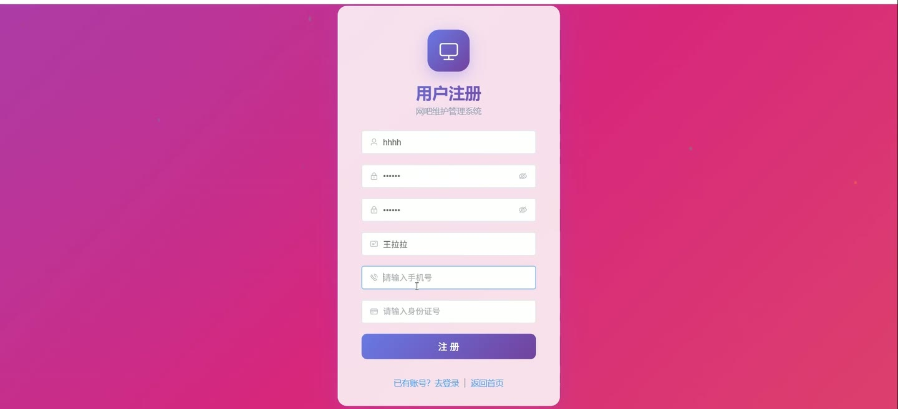
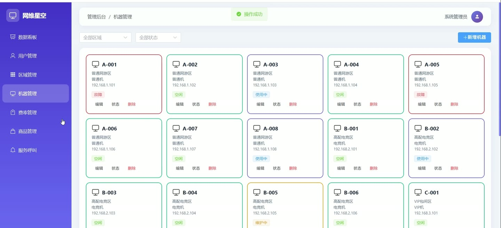
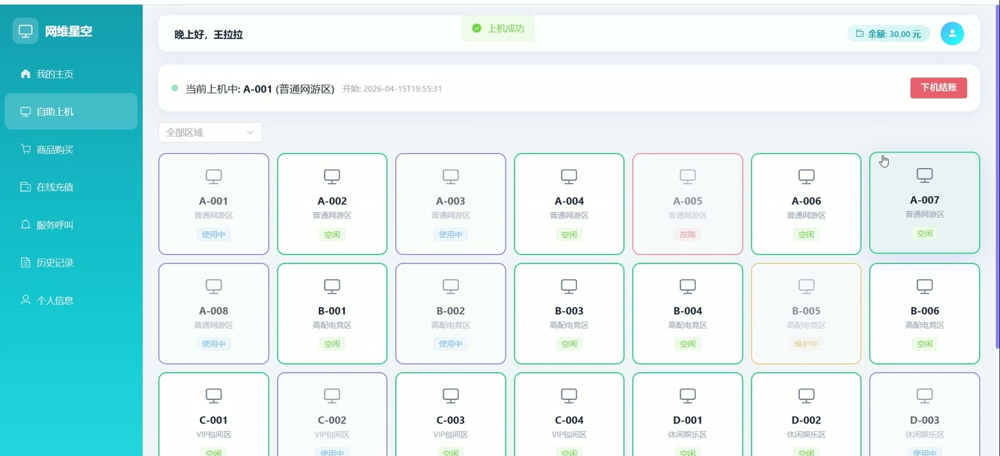
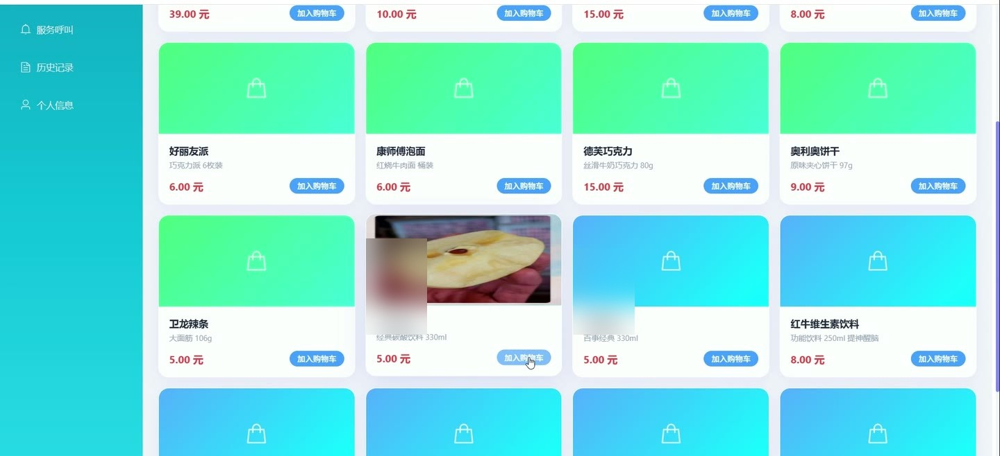
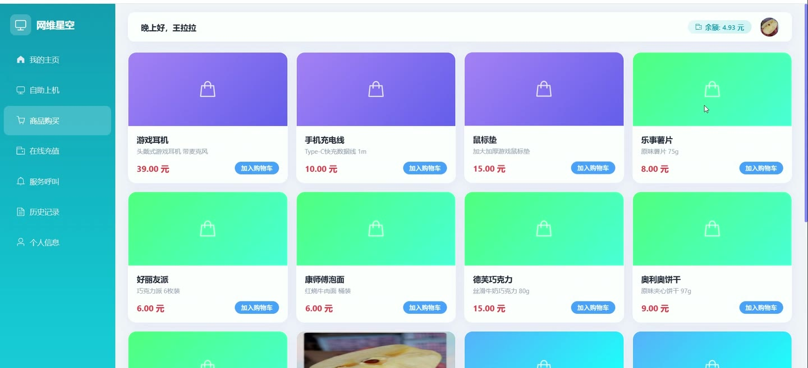
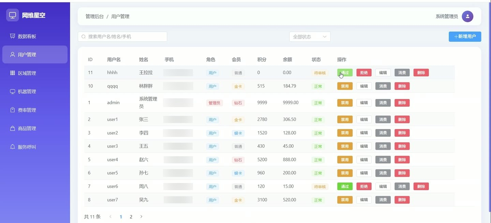

# (附文档)Springboot3+Vue3+MySQL 网吧维护管理系统

**技术栈**：Springboot3、Vue3、MySQL

### 系统简介

网维星空网吧维护管理系统采用 Spring Boot 3 + Vue 3 前后端分离架构，基于 JWT 认证与 MyBatis-Plus 持久层框架实现。系统面向网吧运营场景，提供用户自助上机/下机、在线充值、商品购买、服务呼叫等前端功能，以及管理员后台的区域管理、机器管理、费率配置、商品库存、服务呼叫处理、数据仪表盘等核心管控能力，支持多角色（普通用户与管理员）隔离操作。
 
### 核心功能
 
### 普通用户端

 
- 查看个人资料、修改昵称/手机号/身份证等基本信息（PUT /api/user/profile） 
- 浏览所有启用的区域列表（GET /api/user/zones） 
- 按区域筛选查看机器列表，展示机器编号、类型、状态及所属区域名称（GET /api/user/machines?zoneId=） 
- 查看各区域对应的费率信息，包括每小时价格与会员折扣（GET /api/user/rates） 
- 查询当前正在上机的会话记录，显示机器编号与区域名称（GET /api/user/session/current） 
- 选择空闲机器发起上机操作，系统校验余额并自动锁定机器（POST /api/user/session/start） 
- 主动下机并结算费用，系统按分钟计费、自动扣减余额并增加积分（POST /api/user/session/end） 
- 在线充值，输入金额与支付方式，余额即时到账（POST /api/user/recharge） 
- 浏览商品列表（仅显示启用状态商品），按分类排序查看名称、价格、库存与图片（GET /api/user/products） 
- 提交商品订单，选择商品及数量，系统校验库存与余额后扣减并生成订单（POST /api/user/order） 
- 发起服务呼叫，填写呼叫类型、内容及关联机器编号（POST /api/user/service-call） 
- 查看本人历史服务呼叫记录及处理状态（GET /api/user/service-call/list） 
- 查看本人上机历史记录，包含开始/结束时间、时长、费用（GET /api/user/records/session） 
- 查看本人充值记录，包含金额、支付方式与时间（GET /api/user/records/recharge） 
- 查看本人商品订单记录，包含订单明细与总金额（GET /api/user/records/order） 
- 查看个人仪表盘，包含当前余额、积分、会员等级、是否有上机中的会话（GET /api/user/dashboard）
 
### 管理员端

 
- 查看仪表盘统计：总用户数、在线用户数、总机器数、空闲机器数、今日营收、待处理呼叫数、故障机器数（GET /api/admin/dashboard/stats） 
- 按关键词（用户名/姓名/手机号）和状态分页搜索用户列表（GET /api/admin/user/list） 
- 新增用户，支持设置用户名、密码、角色、手机号、身份证等信息（POST /api/admin/user） 
- 编辑用户信息，可重置密码（自动加密存储）（PUT /api/admin/user） 
- 删除用户（DELETE /api/admin/user/{id}） 
- 启用或禁用用户账号，状态 0=禁用 1=启用（PUT /api/admin/user/{id}/status/{status}） 
- 查看指定用户的消费历史，包括上机记录、充值记录与商品订单（GET /api/admin/user/{id}/consume） 
- 管理区域：新增/编辑/删除区域，设置区域名称、描述、图片与启用状态（POST/PUT/DELETE /api/admin/zone） 
- 按区域和状态筛选机器列表，展示机器编号、类型、IP 地址、所属区域（GET /api/admin/machine/list） 
- 新增/编辑/删除机器，设置机器编号、类型、IP 地址、所属区域（POST/PUT/DELETE /api/admin/machine） 
- 手动更新机器状态：空闲/使用中/故障/维护（PUT /api/admin/machine/{id}/status/{status}） 
- 管理费率：新增/编辑/删除费率，关联区域、设置每小时价格与会员折扣（POST/PUT/DELETE /api/admin/rate） 
- 管理商品：新增/编辑/删除商品，设置名称、分类、价格、库存、库存上下限阈值与启用状态（POST/PUT/DELETE /api/admin/product） 
- 查看商品出入库记录，按商品筛选，展示操作类型（入库/出库）、数量、操作人与时间（GET /api/admin/product-record/list） 
- 新增商品出入库记录，自动更新库存并触发库存上下限预警提示（POST /api/admin/product-record） 
- 查看所有服务呼叫列表，按状态筛选，显示用户、机器、类型、内容与创建时间（GET /api/admin/service-call/list） 
- 处理服务呼叫，标记为已处理并记录处理时间（PUT /api/admin/service-call/{id}/handle） 
- 删除服务呼叫记录（DELETE /api/admin/service-call/{id}）
 
### 技术栈

 后端框架Spring Boot 3.x ORM 框架MyBatis-Plus (BaseMapper + ServiceImpl) 权限认证JWT（jjwt）+ 自定义拦截器 AuthInterceptor 密码加密Spring Security BCryptPasswordEncoder 前端框架Vue 3 (Composition API + setup) 状态管理Vue Router（路由级角色守卫） 构建工具Vite UI 组件库Element Plus 数据库MySQL 8.x 分页插件MyBatis-Plus PaginationInnerInterceptor
 
### 交付内容

 
- 后端完整源码 
- 前端完整源码 
- 数据库初始化脚本 
- 万字文档

## 界面展示

---

## 获取完整源码 + 万字文档

本仓库为项目介绍页。**完整前后端源码、数据库初始化脚本、万字项目文档**，请加微信 `kangkangcode`，或访问 [codekk.top](http://codekk.top) 获取。

可作课程设计 / 毕业设计参考，支持远程部署调试。